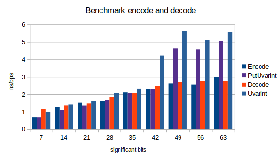

# Variable length unsigned integer encoding

Small unsigned integer values are more frequent than big values. A substantial
compression may then be achieved by dropping the insignificant 0 bits when
serializing integers in a byte sequence. The byte length of the encoded 
integer will then vary according to the number of significant bits. 

The length of the encoded integer must be encoded with the integer bits so
that the original integer can be restored. There exist different ways to 
encode a varying length integer. Here we consider only the encoding of `uint64`
values. 

The most popular of such encoding is 
[LEB128](https://en.wikipedia.org/wiki/LEB128). It allows to encode integers of
any byte size. It is the encoding used in UTF8 characters and in the 
`encoding/binary` package for `Uvarint`. The maximum byte length of an `uint64`
encoded in LEB128 is 10 bytes. 

This package implements the 
[prefix code](https://en.wikipedia.org/wiki/Prefix_code). The significant bytes
are serialized in big endian order, and the most significant bits of the first 
byte set to 1 encode the number of bytes that follow the first byte. This 
encoding requires less bit fiddling than the postfiy code to encode or decode. 
The maximum byte length of an `uint64` prefix encoded is 9 bytes.

An alternate encoding is the [postfix code](). In this encoding the significant 
bytes are serialized in little endian order. The byte length is encoded as a 
number of 0 bits in the last byte which appears first in the encoded byte 
sequence. It may seam more performant than the prefix code since words may be 
written in memory in one instruction on little endian computers, but the bit 
fiddling adds a non nigligible overhead. Benchmarks comparing prefix en postfix
code show indeed that prefix code is more performant when coded in Go.

There exist other encoding as the one use by SQLight, but we don't discuss them
here. 

## Usage

To use this package you must first make sure that you have a `go.mod` file in 
your project. To create a `go.mod` file, you must issue the following command in
your terminal where you replace `myProgram` with the name of your program. 

```bash
$ go mod init myProgram
```

The second step is to import this package in the go source files that will use 
its functions. 

```go
import "github.com/chmike/varint"
```

### Encoding

To encode a `uint64` value, use the following function. It will serialize the 
value in the byte slice and return the number of bytes written. If the slice 
is too small to hold the encoded integer, the function returns 0. The 
function never panics.

```go
func varint.Encode([]byte, uint64) int
```

In your program, you would encode the value `1234` in the byte slice `b` 
like this:

```go
l := varint.Encode(b, 1234)
if l == 0 {
  // b is too small to hold the encoded value
}
b = b[l:]
```

### Decoding

To decode an encoded `uint64` value, use the following function. It will deserialize
the value and return the number of bytes read. If the slice is too small to contain
a value (slice empty or value truncated), the function returns the value 0 and 0 bytes
read. The function never panics.

```go
func varint.Decode([]byte) (uint64,int)
```

In your program, you would decode an encoded value in the byte slice `b` like this:

```go
l, v := varint.Decod(b)
if l == 0 {
  // b is empty or the value is truncated
}
b = b[l:]
```
### difference with the Uvarint functions

These functions have the same API as the `binary.PutUvarint()` and the `binary.Uvarint`
functions and can conveniently replace them. There are a number of differences though. 

- the `Uvarint()` and `PatUvarint` functions may panic
- the function `PutUvarint()` will never return 0
- `Uvarint()` may return a negative number of bytes read in some conditions.

## Preformance 

The extensive study of performance that has led to this code encountered 
weird and unexpected results. On average, the prefix code implementation 
provided here showed better performance than the LEB128 encoding provided 
in the main package.

The benchmark data used in the following graphic is provided in the data.txt
file you will find in the docs directory. 



Encoding with the `PutUvarint()` function is faster for small values 
because the function may be inlined. But even with inlining, it gets slower
than the prefix encoding which is not inlined and requires that the slice is
passed as a value stored on the stack. 

Decoding prefix encoded values is always faster than decoding `Uvarint`
values since none are inlined.